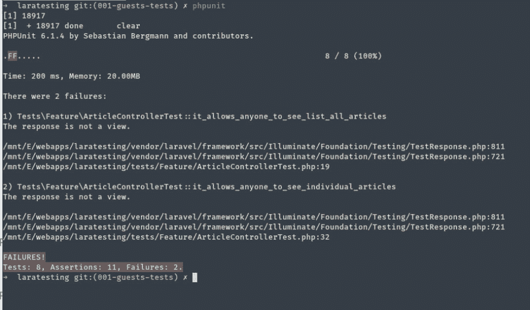

# 在 Laravel CRUD 应用程序上为访客用户功能编写测试

> 原文：<https://dev.to/djug/writing-tests-for-guest-user-functionalities-on-a-laravel-crud-application-2pd9>

> 这是我即将出版的电子书《拉韦尔测试 101》的节选。如果您还没有阅读前面的章节(在这里可以免费获得:[向您的 Laravel CRUD 应用程序添加测试:从哪里开始？](https://youghourta.com/2018/11/27/laravel-testing-101-where-to-start/)这里:[我们应该在一个【laravel】CRUD 应用程序中测试什么？](http://youghourta.com/2018/12/12/what-should-we-be-testing-in-a-laravel-crud-application/))，请先这样做再看这篇。

现在，我们对应该在 Laravel 应用程序中测试的功能有了更好的了解，让我们从测试 guest 可以做什么开始，因为它没有登录用户可以做的复杂。

正如我们在[上一章](http://youghourta.com/2018/12/12/what-should-we-be-testing-in-a-laravel-crud-application/)中所讨论的，以下是我们在应用程序中拥有的与客人相关的功能:

1.  客人在访问时可以看到所有的文章
2.  客人可以看到一篇文章
3.  客人可以看到用户简档
4.  客人不能写新文章，而是被重定向到注册页面
5.  客人可以访问并获得注册页面
6.  客人可以访问并获得登录页面

## 确保 PHPUnit 与您的应用程序一起正常工作

在我们开始编写任何测试之前，让我们确保 **PHPUnit** 与您的应用程序一起正常工作。

PHPUnit 的二进制文件包含在项目的`vendor/bin/phpunit`中，所以您需要做的就是执行它(从项目目录中)。

您应该会看到这样的结果:

[](https://res.cloudinary.com/practicaldev/image/fetch/s--V5MpmSFV--/c_limit%2Cf_auto%2Cfl_progressive%2Cq_auto%2Cw_880/http://youghourta.com/wp-content/uploads/2019/01/011-phpunit-empty.png)

尽管我们还没有编写任何测试，但 Laravel 包含了以下示例测试:

*   `/tests/Feature/ExampleTest.php`
    *   `/tests/Unit/ExampleTest.php`

**P.S.** :我建议为上面的命令添加一个别名，这样您就不需要在每次想要运行测试时都键入`vendor/bin/phpunit`

例如，我使用这个别名:

`alias lphpunit="vendor/bin/phpunit"`

## 1/一个客人在参观的时候可以看到所有的文章`/articles`

因为我们要测试与`ArticleController`相关的功能，让我们首先创建一个专用于这个控制器的类。

`php artisan make:test ArticleControllerTest`

[](https://res.cloudinary.com/practicaldev/image/fetch/s--IWTGzIx2--/c_limit%2Cf_auto%2Cfl_progressive%2Cq_auto%2Cw_880/http://youghourta.com/wp-content/uploads/2019/01/012-phpunit-create-test.png)

注意，我没有将`--unit`标志传递给这个命令，这意味着我们不是在创建一个单元测试，而是一个**特性测试**。新创建的类应该位于`/tests/Feature/ArticleControllerTest.php`

你可以去掉包含在`ArticleControllerTest`中的`testExample`。

让我们创建我们的第一个测试。

当执行 PHPUnit 时，它会寻找所有以`test`开头或者 dockblock 中有`@test`的公共方法。

所以你可以使用这种格式:

```
public function testGuestCouldSeeListOfArticles()
{
...
} 
```

还是这个:

```
/**
* @test
*/
public function it_allows_anyone_to_see_list_all_articles()
{
...
} 
```

我更喜欢第二种，因为它更容易阅读。

我从最基本的测试开始。我只是想确保每当我点击`/articles`路径时，我都能得到一个有效的页面。

```
/**
* @test
*/
public function it_allows_anyone_to_see_list_all_articles()
{
    $response = $this->get(route('get_all_articles'));
    $response->assertSuccessful();
} 
```

保存文件并运行 PHPUnit(或者使用`vendor/bin/phpunit`或者使用我们之前创建的`lphpunit`别名)。

[](https://res.cloudinary.com/practicaldev/image/fetch/s--MzCXmO09--/c_limit%2Cf_auto%2Cfl_progressive%2Cq_auto%2Cw_880/http://youghourta.com/wp-content/uploads/2019/01/013-running-all-tests.png)

我们的测试通过了:)

注意，尽管我们只写了一个测试和一个断言，PHPUnit 告诉我们有 3 个测试和 3 个断言。

> 注意:一个**断言**正在测试一个单一的“东西”，**一个测试可以
> 包含多个断言**。我们上面写的测试只包含一个
> 单一断言`$response->assertSuccessful();`

这背后的原因是 PHPUnit 将运行`/tests`目录中的所有测试。在我们目前所处的阶段，每次运行所有的测试都不成问题，但是如果您想只运行一个测试，您可以将测试的名称(方法的名称)作为参数传递给`--filter`标志，如下所示:
`lphpunit --filter=it_allows_anyone_to_see_list_all_articles`

[](https://res.cloudinary.com/practicaldev/image/fetch/s--ztdYFX-U--/c_limit%2Cf_auto%2Cfl_progressive%2Cq_auto%2Cw_880/http://youghourta.com/wp-content/uploads/2019/01/014-running-single-test.png)

…是的，正如您可能已经猜到的那样，您可以为这个命令添加一个别名，以便在下次您想只运行一个测试时节省时间。

```
alias lphpunit="vendor/bin/phpunit"  
alias lphpunitf="lphpunit --filter=" 
```

`lphpunitf it_allows_anyone_to_see_list_all_articles`

[](https://res.cloudinary.com/practicaldev/image/fetch/s--jKhF88Bt--/c_limit%2Cf_auto%2Cfl_progressive%2Cq_auto%2Cw_880/http://youghourta.com/wp-content/uploads/2019/01/015-running-single-test-alias.png)

如你所知，我们想要测试的不仅仅是得到一个有效的页面，我们想要确保我们得到的是正确的页面。

我们可以通过以下步骤对此进行测试:

*   确保我们得到了正确的视角
*   确保视图包含该页面所需的变量

Laravel 提供了两种方法来测试上述内容:

```
$response->assertViewIs('articles.index');
$response->assertViewHas('articles'); 
```

我们的测试类现在应该是这样的:

```
<?php
namespace Tests\Feature;

use Tests\TestCase;
use Illuminate\Foundation\Testing\WithFaker;
use Illuminate\Foundation\Testing\RefreshDatabase;

class ArticleControllerTest extends TestCase
{
    /**
    * @test
    */
    public function it_allows_anyone_to_see_list_all_article()
    {
        $response = $this->get(route('get_all_articles'));

        $response->assertSuccessful();
        $response->assertViewIs('articles.index');
        $response->assertViewHas('articles');
    }

} 
```

[](https://res.cloudinary.com/practicaldev/image/fetch/s--Fo4ULU9---/c_limit%2Cf_auto%2Cfl_progressive%2Cq_auto%2Cw_880/http://youghourta.com/wp-content/uploads/2019/01/016-running-first-test.png)

既然我们可以测试我们正在获得正确的视图(使用正确的变量)，我们不再需要保留第一个断言，因为它是隐式的。

## 2/一个客人可以看到一篇文章

既然我们已经测试了访客用户可以查看所有文章的列表，那么让我们确保她也可以查看单个文章。

为了确保该功能(向访客用户显示单个文章)按预期工作，我们需要以下步骤:

1.  获取要查看的文章(随机)
2.  生成到这篇文章的路由，并向它发送一个`GET`请求
3.  确保我们获得了正确的视图(在本例中为`articles.view`)
4.  确保返回的视图包含一个名为`$article`的变量
5.  确保我们得到的是我们想要访问的文章，而不是另一篇。

我们的测试应该是这样的:

```
/**
* @test
*/
public function it_allows_anyone_to_see_individual_articles()
{
    $article = Article::get()->random();
    $response = $this->get(route('view_article', ['id' => $article->id]));

    $response->assertViewIs('articles.view');
    $response->assertViewHas('article');
    $returnedArticle = $response->original->article;
    $this->assertEquals($article->id, $returnedArticle->id, "The returned article is different from the one we requested");
} 
```

> 注意:
> 我们可以通过`$response->original`变量访问返回的视图

您可能会问，为什么我们要为这么简单的功能做所有这些步骤。这个特性确实很简单，它的测试也很简单……简单，但并不琐碎。

我们采取所有这些步骤是为了确保以下几点:

*   我们希望每次都能访问一篇随机的文章(我们不希望总是请求相同的 ID 或相同的文章)，因为我们可能会在代码中遇到一个问题，使得应用程序总是返回相同的文章。例如，想象一下，由于某种原因，我们没有搜索特定的文章，而是更新了代码以使用`Article::first()`，如果我们一次又一次地返回相同的文章(使用相同的 ID ),我们将无法检测到这个问题。
*   强烈建议在测试中使用 routes 而不是 URL，因为如果您改变了 URL 的结构，您就不需要更新您的测试。
*   我们还想确保我们确实得到了我们所请求的文章，因为我们可能得到包含我们正在寻找的变量的正确视图，但是它可能包含与我们所请求的不同的文章。

## 3/一个客人可以看到一个用户的个人资料

这一个应该看起来很像前面的测试，因为概念是相同的(访问一个模型并返回它)，但是我们访问的是一个用户而不是一篇文章。由于我们在这里不是测试文章，我们应该首先创建一个新的测试类:

`php artisan make:test UserControllerTest`

那么我们需要做的就是添加下面的测试:

```
/**
 * @test
 */
public function it_allows_anyone_to_see_users_profiles()
{
    $user = User::get()->random();

    $response = $this->get(route('show_user_profile', ['id' => $user->id]));

    $response->assertViewIs('users.show');
    $response->assertViewHas('user');

    $returnedUser = $response->original->user;

    $this->assertEquals($user->id, $returnedUser->id, "The returned user is different from the one we requested");
} 
```

[](https://res.cloudinary.com/practicaldev/image/fetch/s--_bjuTvJl--/c_limit%2Cf_auto%2Cfl_progressive%2Cq_auto%2Cw_880/http://youghourta.com/wp-content/uploads/2019/01/017-running-user-profile-test.png)

## 4/一位客人无法写新文章，而是被重定向到注册页面

这种方法(以及本章中的其余方法)要简单得多，因为它们不需要访问数据库。

为了测试该功能，我们需要以下步骤:

*   尝试进入`create_new_article`路线
*   测试我们是否被重定向到登录页面[登录或注册页面？]

测试应该是这样的:

```
/**
* @test
*/
public function it_prevent_non_logged_in_users_from_creating_new_articles()
{
    $response = $this->get(route('create_new_article'));
    $response->assertRedirect('login');
} 
```

## 5.客人可以访问并获得注册页面和 6。客人可以访问并获得登录页面

这两个测试甚至更容易编写，因为我们只是检查当我们试图访问登录和注册页面时，我们是否得到了有效的页面。因为我们使用的是 Laravel 内置的认证控制器，所以我们不需要自己测试认证。

对于这两个测试，我们也需要一个新的测试类。我们可以为他们创建一个专门的类。通常我把所有的“页面测试”(即当我们点击某个 URL 时确保我们得到有效页面的测试)放在一个`PagesControllerTest`(特别是如果我有一个名为`PagesController`的控制器)；或者只为`HomeController`创建一个测试类，因为在大多数情况下，我会将我测试的页面的逻辑添加到这个类中。

这两个测试用例应该是这样的:

```
/**
* @test
*/
public function it_returns_register_page()
{
    $response = $this->get(route('register'));
    $response->assertSuccessful();
} 
```

```
/**
* @test
*/
public function it_returns_login_page()
{
    $response = $this->get(route('login'));
    $response->assertSuccessful();
} 
```

此外，我们不只是检查我们是否得到了一个有效的页面(在这种情况下已经足够了)，我们还检查我们是否得到了正确的视图，如下所示:

```
/**
* @test
*/
public function it_returns_register_page()
{
    $response = $this->get(route('register'));
    $response->assertViewIs('auth.register');
} 
```

```
/**
* @test
*/
public function it_returns_login_page()
{
    $response = $this->get(route('login'));
    $response->assertViewIs('auth.login');
} 
```

## 测试如何检测代码库的重大变化？

正如我们在前一章中所讨论的，编写测试的一个目标是确保应用程序的功能将按照我们最初构建它们时的预期方式工作。

我想展示一个简单的例子，测试将如何通知我们，我们正在引入一个改变应用程序行为的新代码(一个突破性的改变)。

让我们假设在这个应用程序上工作了几个星期后，我们出于某种原因决定从这个:
更新`ArticleController`的构造函数

```
public function __construct()
{
    $this->middleware("can:manage,article")->only('edit', 'update', 'delete');
    $this->middleware("auth")->only('create');
} 
```

对此:

```
public function __construct()
{
$this->middleware("can:manage,article")->only('edit', 'update', 'delete');
$this->middleware("auth");
} 
```

唯一的变化是从构造函数的第二行删除了`->only('create')`。

这可能是偶然发生的(一个队友没有看到用这个中间件只保护一个动作的价值),也可能是有意为之，以防止访客在登录前阅读文章。

如果我们运行测试，我们会得到这个:

[](https://res.cloudinary.com/practicaldev/image/fetch/s--wl98q1AV--/c_limit%2Cf_auto%2Cfl_progressive%2Cq_auto%2Cw_880/http://youghourta.com/wp-content/uploads/2019/01/018-failed-test-because-of-breaking-change.png)

在编写应用程序的任何测试之前，您可能不会很快注意到这种突破性的变化。也许突破性的改变甚至会在没有人注意到的情况下被部署，因为大多数时间你都是以登录用户的身份使用你的应用程序，你不会认为你需要在应用程序的每一个小的改变之后测试来宾功能。

但是通过测试，任何突破性的变化都会被立即检测出来，甚至不需要手动测试应用程序。如果你在你的项目中设置了一个 CI(持续集成)(我们将在后面的电子书中探讨如何设置它),如果不先解决这个问题，你甚至不能合并/部署。

## 结束语

在本章中，我们探讨了测试来宾用户功能所需的不同步骤。我们已经看到，尽管测试很简单，但它们有时需要多个步骤来确保我们测试的是正确的东西，并且我们没有遗漏一些边缘情况(尤其是当我们引入可能破坏应用程序的变更时)。我们还看到了测试如何检测代码库中的重大变化。

在接下来的章节中，我们将探索与登录用户相关的测试，这可能比我们目前看到的测试更具挑战性。

如果你想继续下去，并得到关于这本书的任何进展的通知(例如新的免费章节)，请在这里注册:[https://laraveltesting101.com/](https://laraveltesting101.com/)