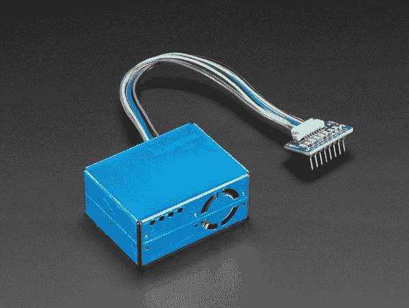
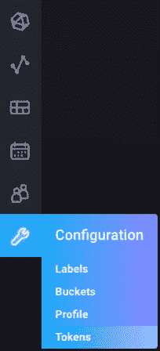

# 从 Arduino ESP8266 写入 InfluxDB 2.0

> 原文：<https://dev.to/davidgs/writing-to-influxdb-2-0-from-arduino-esp8266-46i8>

随着 InfluxData 越来越接近 2.0 版，将数据**放入** InfluxDBv2 变得越来越重要。有道理，对吧？由于我的绝大多数数据(比如，无法区分 100%)来自物联网设备，我决定是时候开始让这些设备支持 InfluxDB v2 了。

我很高兴地说，朝着这个方向迈出的第一步已经完成！我最喜欢的传感器之一是颗粒物传感器，它可以测量空气中非常小的颗粒(直径从 2.5 米到 100 米)的数量。事实证明，这种东西真的对你有害，所以知道空气中有多少是个好主意。为此，我从 Adafriut 订购了其中一款传感器:

[](https://res.cloudinary.com/practicaldev/image/fetch/s--zVAzWpqw--/c_limit%2Cf_auto%2Cfl_progressive%2Cq_auto%2Cw_880/https://davidgs.com/wp-content/uploads/2019/03/3686-10.jpg)

它很小，很容易连接到几乎任何东西，因为它只是通过 UART 输出数据。由于我周围有一大堆 ESP8266 板(我通常按打订购，因为它们非常便宜，容易处理)，我将它连接到其中一个。代码很简单，这要感谢 Adafruit 提供了它，并且有一个 handle InfluxDB 库可以用来写数据，但它只支持 InfluxDB v1.x。我做的第一件事(因为我很急)是抓取 1.x 库，然后只需为 2.x 重写它。花了我大约 1/2 个小时或更少，它工作得很好！(如果你愿意，你可以在这里使用那个版本)。然而，这真的不是 T2 正确的解决方案。所以今天我回去创建了一个[原始存储库](https://github.com/tobiasschuerg/ESP8266_Influx_DB)的适当分支，并更新它以支持 InfluxDB 的 1.x 或 2.x 版本。当然，我已经提交了一个针对原始库的适当的 Pull 请求，并希望它能很快被接受/合并。

让我们看看使用这个新库需要什么。非常简单，真的。至少有了 Arduino，你所要做的就是添加库，然后把它包含在你的草图里:

```
#include <InfluxDb.h>
//#include <InfluxDataV2.h> // if you want to use the other library I built and that’s in my GitHub 
#define INFLUXDB_HOST “myhost.com"
Influxdb influx(INFLUXDB_HOST); 
```

这让你开始。接下来，您将需要一些来自 InfluxDB v2.0 的特定信息(alpha still！)安装。值得注意的是，您将需要与您的帐户相关联的`organization`、`bucket`和`token`。您可以通过将您的 web 浏览器指向您的 InfluxDB 服务器端口 9999，输入您的用户名和密码，然后转到配置页面来找到它们:

[](https://res.cloudinary.com/practicaldev/image/fetch/s--JejVIV3d--/c_limit%2Cf_auto%2Cfl_progressive%2Cq_auto%2Cw_880/https://davidgs.com/wp-content/uploads/2019/03/Screen-Shot-2019-03-22-at-1.26.56-PM.png)

然后，您可以将它们输入 Arduino 草图:

```
influx.setBucket(“myBucket");
influx.setVersion(2);
influx.setOrg(“myOrg");
influx.setPort(9999);
influx.setToken(“myToken"); 
```

一旦你完成了，在你的`setup()`函数中，你就可以开始向你的 v2.0 流入服务器写数据了！

```
void loop() {
loopCount++;

InfluxData row("temperature");
row.addTag("device", "alpha");
row.addTag("sensor", "one");
row.addTag("mode", "pwm");
row.addValue("loopCount", loopCount);
row.addValue("value", random(10, 40));

influx.write(row);

delay(5000);
} 
```

看到了吗？我告诉过你这很容易！

Arduino ESP8266 写给 InfluxDB 2.0 的帖子[最先出现在](https://davidgs.com/2019/writing-to-influxdb-2-0-from-arduino-esp8266/)[的大卫·g·西蒙斯](https://davidgs.com)上。