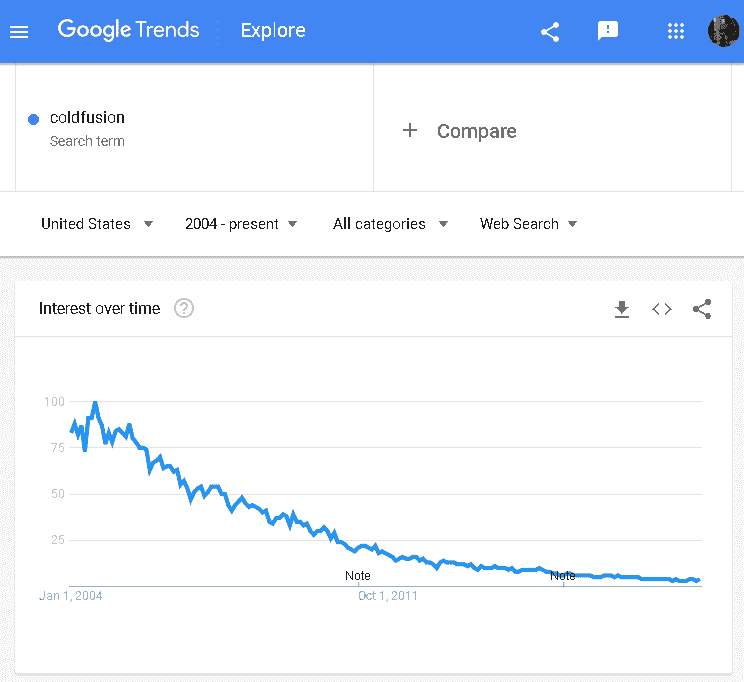
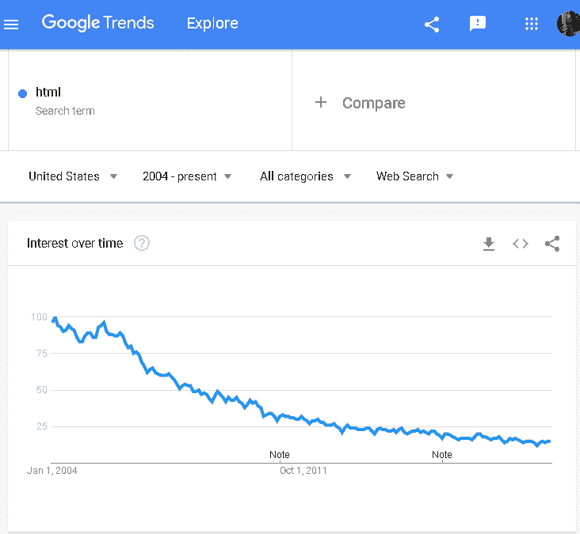

# 是的，ColdFusion 是“不受欢迎”的。不，我不在乎。

> 原文：<https://dev.to/mikeborn/yes-coldfusion-is-unpopular-no-i-don-t-care-5f8c>

CF 上流行恨，流行说 ColdFusion“快死了”。流行称 CF 为“遗留”语言，并将其与 COBOL 进行比较。但是 ColdFusion *真的*不受欢迎吗？更重要的是……*这有关系吗*？

我想 ColdFusion 领域的大多数开发者都知道抨击 ColdFusion 现在有多流行——特别是 CF 本身的不受欢迎。最近，我们甚至在 [CommitStrip 漫画](http://www.commitstrip.com/en/2018/12/13/its-basically-the-same-thing/)中得到一个有趣的参考:

漫画的目的是在 CF 上开一点玩笑——这很好！但这确实让我想到了 ColdFusion / CFML 的普遍“不受欢迎”。所以这就是我不在乎 ColdFusion 是否不受欢迎的原因。

## 第一:所有的语言都有波动(因此所有的语言有时都“不受欢迎”)

编程语言“流行度”波动的两个例子——不管是真实的还是感觉到的。

1.  露比-不，真的！
2.  原来谷歌趋势是一种愚蠢的衡量语言流行程度的方法

### 红玉没有死

还记得那个叫 Ruby 的东西吗？你知道，为 Kickstarter、Soundcloud、Basecamp 和 Etsy 提供动力的脚本语言？显然，现在说“鲁比死了”很酷。相比现在的后起之秀(曾经的 Ruby，现在的 Node)，所有代码都是“冷门”。看看 TechRepublic 的[这篇毫无价值的文章，引用了“Ruby 之死”:](https://www.techrepublic.com/article/the-death-of-ruby-developers-should-learn-these-languages-instead/)

> Ruby 在工作场所和编码训练营的受欢迎程度已经下降，而领导者们质疑开源编程语言的持久力。

又来了——流行度，这个愚蠢的衡量标准只在博客文章和线图中有用。这篇文章在引用 Stack Overflow 的数据科学家大卫·罗宾逊的智慧时变得理智了:

> “语言几乎不会消亡，”罗宾逊说。“人们在其中建造了许多有用的基础设施，当它们成为生态系统的重要组成部分时，这些基础设施可以持续几十年。这不是生与死的问题，而是增长还是萎缩的问题。”

TechRepublic 承认他们的“Ruby 之死”的整个前提真是太好了文章有缺陷。这是又一篇渴望点击的博客文章，没有什么经验，也没有引用语言过早死亡的事实。

### HTML 没有死

听我说完- *当然* HTML 没有死，对吧？对吗？

在我的 2019 年帖子[中，有一些有趣的反馈，来自一位开发人员，他告诉我:](https://michaelborn.me/entry/five-reasons-to-learn-cf-in-2019)

> “我在搜索 ColdFusion 的人数中看到了一个[明确的模式。你会如何解读这个图表？”](https://trends.google.com/trends/explore?date=all&geo=US&q=coldfusion)

作为参考，这是他提到的从 2004 年到现在的“ColdFusion”搜索的谷歌趋势图:

我的反应是链接到同一时间段的 HTML 的同一个[谷歌趋势图。](https://trends.google.com/trends/explore?date=all&geo=US&q=html)

所以让我问你 HTML 死了吗？；)

或者仅仅是因为受欢迎程度是一个无意义的指标(说真的，谷歌搜索算不算什么？)来“评级”一门编程语言？我们说的是编程语言，不是电视人物！

## 二:ColdFusion 正在运行世界

当你们这些傻瓜说我们不受欢迎的时候，我们正忙着管理这个世界——从健康和银行到政府和电信公司。Adobe 的宣传工具包指出，财富 100 强中有超过 70%的企业使用 ColdFusion。我同意应该对统计数据持保留态度——毕竟，很可能许多公司并没有将 ColdFusion 作为他们的主要谋生工具，而且很可能会将他们的 ColdFusion 应用程序视为遗产。但该工具包也指出，70%的 Adobe ColdFusion 客户仍在用 CF 开发新的应用程序——这意味着*他们仍认为该平台对未来的扩展是可行的*。这些不是拿走你的资金然后在三年内死去的创业公司，他们不是夫妻店电子商务网站，他们是世界上最大的与 CFML 一起开发新应用的公司。吃吧。:)

## 三:ColdFusion 太流行，不会冷门

许多“ColdFusion 死了吗？”演变成“ColdFusion 像 COBOL 一样死了”式的争论。(如果你真的希望看到这种言论，你可以在 Adobe 论坛的帖子中找到几个这样的比较。)

这并不成立，原因很简单，即将消亡的语言没有跟上时代的步伐！查看 Wikipedia 上的 COBOL 版本列表[——坦率地说，自 80 年代以来，只有两个主要版本的发布给 COBOL 生态系统带来了明显的厄运。](https://en.wikipedia.org/wiki/COBOL#History_and_specification)

相比之下，Adobe ColdFusion 自 2012 年以来发布了四个主要版本，Lucee 自 2015 年以来发布了一个主要版本和四个次要版本。我是说，说真的- [看看 Lucee Docker 图片](https://hub.docker.com/r/lucee/lucee/tags)上的标签列表。这是*而不是*死语言的工作方式！

## 四:“流行”不等于“有用”

受欢迎不是最终目标。我再说一遍:*人气不是最终目标*！如果你选择的语言每两年发布一次，并且有成千上万的活跃开发者，那么除非这种语言有用，否则它一点也没用。Node.js 作为一种语言，如果没有其庞大的开源生态系统，几乎毫无价值。如果不使用数十或数百个 npm 库，你将找不到任何运行在 Node 上的真实应用程序，因为 *Node 本身并没有用*。

这不是一件坏事！Node 是一种很好的学习语言，由于它的广泛流行和庞大的软件包生态系统，Node 非常强大——但是请记住，如果没有这个生态系统，Node 作为一种语言将只是历史上的一个脚注。

关于 CFML，特别是 Lucee，我的观点是快速、简单的 jvm 语言将*总是*有用和相关的。当你可以在一个小时内建立一个表格，处理这个表格并发送一封电子邮件时(而且这一切都不需要离开 CFML)，你就拥有了在其他地方很难找到的优势。如果我使用 Node，我不确定一个小时是否足够让我[选择一个 npm 包](https://teamtreehouse.com/library/how-to-find-and-choose-packages)！；)

## 结论

我已经不在乎“受欢迎”了。除非市场不再关心快速、稳定、强大的语言，否则 CF 只能从这里往上走。