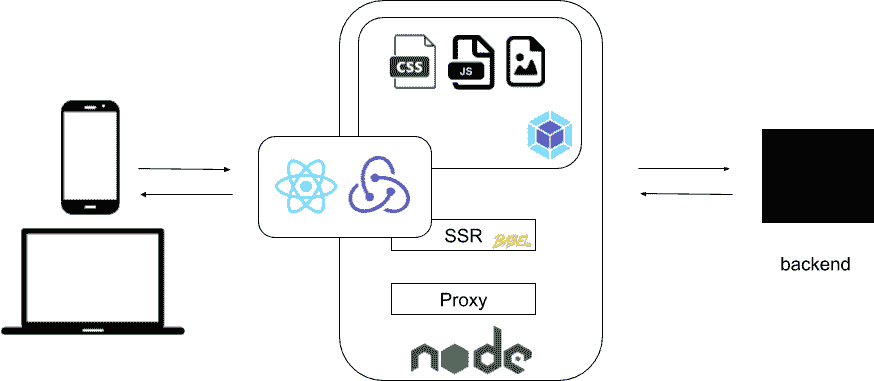
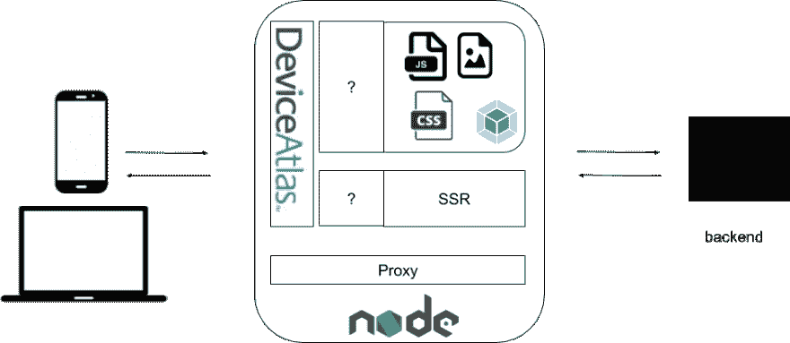
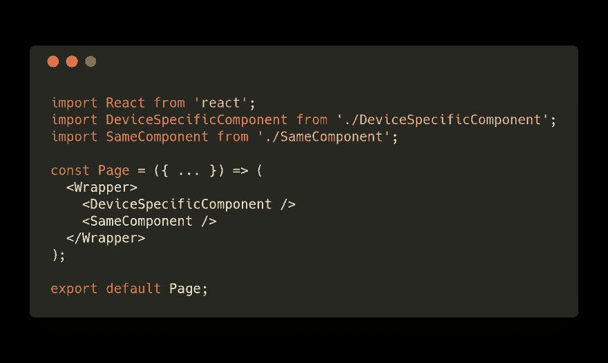
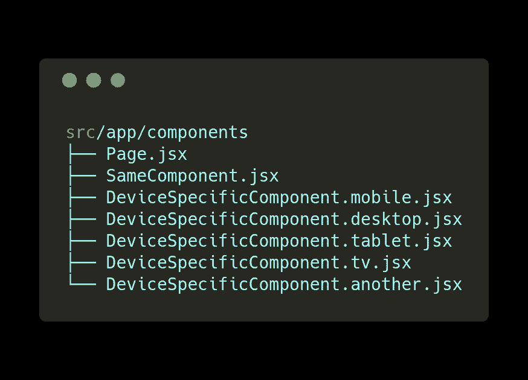
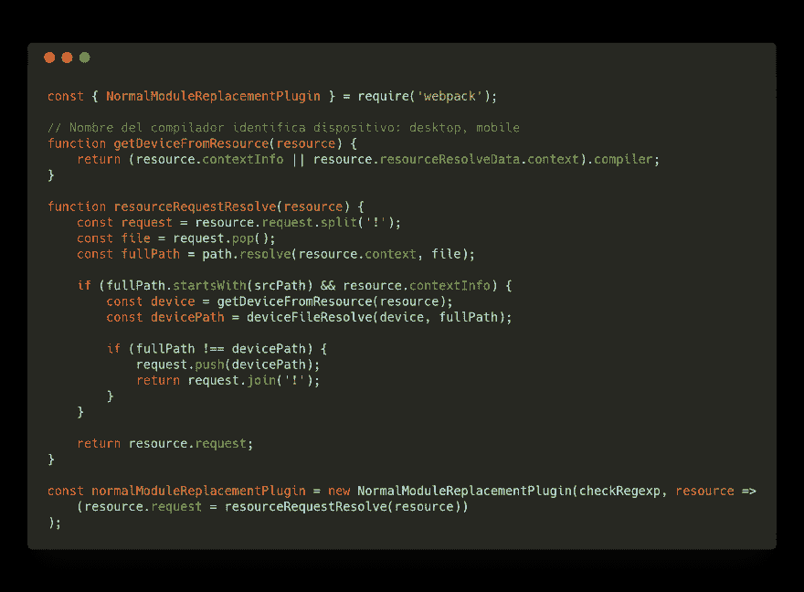

# 你不想把所有的鸡蛋放在一个篮子里:为每个设备构建捆绑包

> 原文：<https://dev.to/nickcis/you-dont-want-to-keep-all-of-your-eggs-in-one-basket-building-bundles-per-device--2f5c>

这是我做的第一个演讲的总结，叫做“No metas todo en la misma Bolsa:generando bundles por disposivo”(可以翻译成本文的标题)。
[**2018-07-react js-No metas todo en la misma bolsa.pdf**
*定义每个设备的具体特性，而无需为每个设备开发平台。*drive.google.com](https://drive.google.com/file/d/1vnsMVslNssKV3W3Mv_i2ZwCa5Gh9GZp3/view?usp=sharing)

**这是系列文章的第一篇**,我将解释如何构建一个针对特定设备约束的 react 渐进式 web 应用程序:

*   构建每个设备的捆绑包(这篇文章)

*   *避免样板文件:开发 razzle 插件(wip)*

*   *概括:开发一个 webpack 插件(wip)*

*TL；dr；这个想法是以惰性编程的方式逐渐开始为每个设备(例如:移动/桌面)提供特定的体验。*

在这篇文章中，我将给出一个要解决的问题的背景和第一次尝试。虽然，这篇文章会谈到一个具体的特性，我不会展示太多的代码，下面的文章会有工作的例子。

## 问题

每个开发人员都知道，问题是由产品团队产生的。

我们已经开始对每台设备都有了过于具体的 UI 要求。其中一些通常涉及使用只针对该设备的库(例如:拖放功能只在桌面上需要，在移动设备上不需要)。

包的大小开始增加，代码开始变脏，设备之间的差异越来越大。

当时，PWA 团队是一个小团队(只有大约 5 个开发人员)，我们可以划分平台，将每个设备视为一个特定的开发。此外，我们有一个可工作的产品，我们需要增量地进行更改。

虽然许多团队可能都有这个问题，但开发的解决方案并不是灵丹妙药。它解决了我们的特殊限制和特点。在这篇文章中，我的目标是给出一些关于这个解决方案是如何实现的过程的见解。

## 堆栈

首先，我要简单介绍一下开发平台的协议栈。

T3】PWA 技术栈

PWA 使用与 webpack 捆绑在一起的常见 React+Redux+React 路由器堆栈。

服务器代码用 babel 编译，以便重用 react 组件进行服务器端渲染。

后端是外部微服务。PWA 的服务器有一个代理，以便与他们通信。

## 选项

正如我之前说过的，我们的想法是开始为每个设备优化平台。

我们想到了三种可能的方法:

*   **适应性/响应性设计**:为所有客户端提供相同的 javascript、css 包和 html，并使用响应性大小和媒体查询，以便根据设备的宽度改变用户体验。

*   **分离站点**:为每个设备开发一个分支。这将包括开始将公共代码转移到包或类似的东西中，以避免代码重复。

*   **动态服务:**根据请求头(主要是*用户代理*)提供不同的内容(js、css 包)。这种方法的问题是研究一种构建不同包的方法，而不必对当前代码进行彻底的修改。

我们使用了适应性/响应性方法，这导致了一些问题:

*   客户端收到 web *副本*，包括移动和桌面组件。

*   代码变得有点乱

*   客户端收到了不必要的库(即:移动客户端也收到了桌面专用库)

我们希望减少开发人员的初始学习曲线(简单的开发人员过渡)和长期维护工作。至于分离站点的方法，我们应该分叉当前的代码库并维护不同的代码库(一个巨大的长期维护工作)或重构当前的代码库，以便提取所有的公共代码，然后分叉(硬转换，因为开发人员应该了解如何编写公共代码，以便在分叉之间共享它)。所以，这种方法是行不通的。

## 动态上菜

我们最终选择了“动态服务”方法。为了做到这一点，我们应该解决一些问题:

*   了解如何猜测客户端是什么设备(例如:它是移动设备吗？，桌面？)

*   生成特定于设备的包

该公司已经有了一份 DeviceAtlas 合同，所以这是一个简单的选择。DeviceAtlas 是一个用于在 web 环境中解析用户代理字符串的设备检测解决方案，所以这正是我们所需要的。

 *拟建建筑*

接下来的问题是构建特定于设备的包，而不必对开发人员的工作方式进行巨大的改变。我们的想法是试图在编译时解决所有问题，这样我们就不会有任何运行时损失，同时也有一个简单的开发者体验。

理想情况下，开发人员应该编写这样的组件:

同时具有以下文件结构:

对于每个设备捆绑包，它将解析为适当的文件(即:对于移动捆绑包为*devicespecificcomponent . mobile . js*，对于桌面捆绑包为*devicespecificcomponent . desktop . js*，等等)。

幸运的是，Webpack 有一个名为[NormalModuleReplacementPlugin](https://webpack.js.org/plugins/normal-module-replacement-plugin/)的插件，它允许改变资源分辨率。但是，为了使用这种方法为每个设备构建包，需要为每个设备进行编译。为了解决这个问题，webpack 提供了[多编译器特性](https://github.com/webpack/webpack/tree/master/examples/multi-compiler)。

*NormalModuleReplacementPlugin 配置*

概括一下:

*   每个设备有两个版本，一个用于节点服务器 ssr，另一个用于浏览器。

*   一个服务器*要求*所有设备特定的 SSR 捆绑包，使用 DeviceAtlas 来找出客户端是什么类型的设备，运行特定的 SSR 设备捆绑包并为特定的设备捆绑包提供服务

*   开发人员不必考虑他/她的目标是什么设备，只需包含组件并编写设备特定的实现(使用文件命名约定)。

在本系列的下一篇文章中，我将讨论如何将实现这个特性的所有样板文件抽象成一个 razzle 插件。将会有更简洁的工作代码的例子！