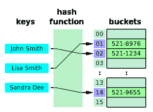
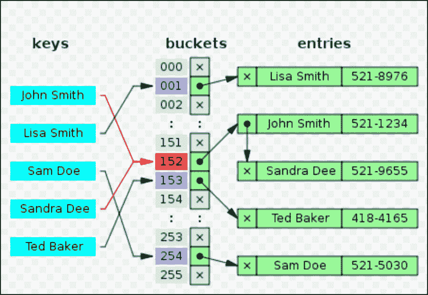

# 让我们实现一个散列表

> 原文：<https://dev.to/ishankhare07/you-think-you-understand-key-value-pairs-m7l>

### hashmap 是如何工作的？

好的，让我们从什么是散列表开始。Hashmaps 或 hashtables 在不同的语言中有不同的名称。

*   Python 有字典/词典
*   Ruby 称之为 Hash
*   Java 有 hashmap
*   C++有 unordered_map
*   甚至 javascript 也有映射，这就是 Javascript 中对象的基本实现方式。(看看 JSON 就知道了)

最后一点是关于 hashmaps 被用来在 Javascript 中实现对象，这在 Python、Ruby 和其他一些语言中也是正确的。

所以 hashmap/dicts/hashtables 不管你想叫它们什么，基本上都是键值存储数据结构。你传入一个由键标识的值，你可以用那个键得到相同的值——就这么简单。

* * *

所以让我们试着了解一下它在代码中的样子。

```
a = {}

# add a key-value pair a['name'] = 'ishan'

# lets see whats in there print(a)
# {'name': 'ishan'} 
# add more key-value pairs a['age'] = 23
a['gender'] = 'male'
print(a)
# {'gender': 'male', 'age': 23, 'name': 'ishan'} 
# note above that the keys are not in the same order as we entered them,
# this is because python's dictionaries are unordered
# see https://stackoverflow.com/a/15479974/2972348 
# get a specific value print(a['name'])
# 'ishan' 
# let's update a value a['age'] = 24
print(a)
# {'gender': 'male', 'age': 24, 'name': 'ishan'} 
# let's delete some values del a['age']
print(a)
# {'gender': 'male', 'name': 'ishan'} 
```

这给了我们一个字典的基本操作列表:

1.  插入
2.  取得
3.  删除

同样可以用 Javascript:
来展示

```
a = {}

a['name'] = 'ishan'
console.log(a)
// { name: 'ishan' }

// or the other way
a.age = 24
console.log(a)
// { name: 'ishan', age: 24 }

console.log(a.name)
// ishan

delete a.age
console.log(a)
// { name: 'ishan' } 
```

例子已经够多了，让我们来看看这些东西在内部是如何工作的

* * *

因此，我们将在 Golang 中实现一个简单的散列表。如果你没有听过或写过 Go 代码，并且对理解后面的代码持怀疑态度——不用担心，Go 有一个与 C 和 Javascript 非常相似的语法。如果你会编码(用一种语言)，你会做得很好！

* * *

#### 积木

这张来自维基百科的图片展示了我们散列表的基本结构。这将帮助我们更好地理解和分解手头的问题:

[](https://res.cloudinary.com/practicaldev/image/fetch/s--9Jzt8Q80--/c_limit%2Cf_auto%2Cfl_progressive%2Cq_auto%2Cw_880/https://ishankhare.com/medimg/Hash_table_3_1_1_0_1_0_0_SP.png)

简而言之，我们有:

*   哈希函数
*   哈希函数映射到的线性数组
*   以及保存我们的键值对的实际数据节点

#### 本阵

所以让我们从我们的 ***线性阵列*** 开始。所以我们基本上需要一个静态分配的数组，大小为 n。这将是保存指向实际键值对的指针的数组。这就是我们的基本阵列的样子:

```
 +----+
1 |    |
  +----+
2 |    |
  +----+
3 |    |
  +----+
4 |    |
  +----+
5 |    |
  +----+
6 |    |
  +----+
7 |    |
  +----+
8 |    |
  +----+
9 |    |
  +----+
10|    |
  +----+ 
```

让我们用 Go 把这个编码起来。在 hashmap 数据类型中包含一个基本数组。这很容易实现。

```
package main

import "fmt"

const MAP_SIZE = 50

type HashMap struct {
    Data []*int 
}

func NewDict() *HashMap {
    return &HashMap{}   
}

func main() {
    a := NewDict()
} 
```

上述代码解释如下:

1.  我们用 package main 将当前文件声明为主包。
2.  我们导入了一个名为“fmt”的包，我们稍后将使用它来将东西打印到终端。
3.  我们声明一个常量变量 MAP_SIZE，值为 50。这将是我们的线性阵列的大小。

    > 为了简单起见，我们假设我们只有一个固定大小的数组，用于实现 hashmap，并且没有考虑调整大小。实际的实现确实考虑到了这些事情——这将在以后的博客文章中讨论。欲了解更多信息，请参考这里。

4.  接下来我们创建一个函数 NewDict，它为我们创建这个数组并返回一个指向它的指针。

这就完成了阵列本身的基本结构。但是我们面临着下一个挑战。也就是说，如何表示包含实际数据的键-值对，并将其与数组链接起来。

#### 创建节点并与数组链接

上面给出的代码中有一个问题——我们创建了一个指向整数 值的 ***指针数组。基本上就是**线上的`Data []*int`8**。这是错误的，因为我们实际上需要**而不是**指向整数，而是 ***某个保存我们的键值对的*** 对象。我们还不知道这个对象是什么，但是我们知道它至少需要两个字段——键和值。所以让我们继续在代码中创建这个新对象的结构。***

我们添加以下几行:

```
type Node struct {
    key string
    value string
    next *Node
} 
```

我们创建一个结构来保存我们的键值对和一个指向节点 类型的 ***指针。我们稍后将需要这个指针来处理散列冲突。稍后再详细介绍，现在就让它呆在那里吧。***

现在，既然我们希望数组的每个索引都指向这些 ***节点*** 类型，我们应该改变数据数组的类型。

```
type HashMap struct {
    Data []*Node
} 
```

所以在这些变化结束时，我们的代码应该是这样的:

```
package main
import "fmt"
const MAP_SIZE = 50

type Node struct {
    key string
    value string
    next *Node
}

type HashMap struct {
    Data []*Node
}

func NewDict() *HashMap {
    return &HashMap{ Data: make([]*Node, MAP_SIZE) }
    // we initialize our array with make(), see 
    // https://golang.org/pkg/builtin/#make

}

func main() {
    a := NewDict()
    fmt.Println("%q", a)

} 
```

如果您现在运行这个程序，您应该会看到类似这样的内容:

```
&{[<nil> <nil> <nil> <nil> <nil> <nil> <nil> <nil> <nil> <nil>
<nil> <nil> <nil> <nil> <nil> <nil> <nil> <nil> <nil> <nil>
<nil> <nil> <nil> <nil> <nil> <nil> <nil> <nil> <nil> <nil>
<nil> <nil> <nil> <nil> <nil> <nil> <nil> <nil> <nil> <nil>
<nil> <nil> <nil> <nil> <nil> <nil> <nil> <nil> <nil> <nil>]} 
```

我们的 hashmap 对象由一个包含 50 个指针 的 ***数组组成，每个指针都指向`<nil>`，这相当于:***

*   `NULL`在 c。
*   `null`在爪哇。
*   `None`在 Python 中。
*   `undefined`在 Javascript 中。

正如所料，我们没有在哈希表中插入任何值，所以所有指针都指向`null` / `nil`。接下来，我们必须考虑将对象插入到散列表中。

> 在我们达到这一点之前，我们需要找到一种方法将我们的键转换成数组上相应的索引。

哈希映射的典型实现依赖于一个好的哈希函数。散列函数的工作是转换传递给它的值(在我们当前的例子中是一个字符串),并返回一个表示数组索引的整数值。而且这个整数值 ***每次*** 都要一样。

这意味着如果`hash("hello")`给我`966170508347869221`，那么每次我通过`"hello"`时，我应该得到相同的`966170508347869221`作为返回值。

> 您可以在 Python 解释器中测试上述代码。Python 有一个内置函数`hash`，它将返回哈希值。

但是我们的数组中不能有索引`966170508347869221`。目前我们只有索引`1-49`可用。因此，我们需要设法把它降低到这个范围。

#### 模去救援

这个问题最简单的解决方案是使用模(`%`)操作符。这个运算符给出了除法运算的余数。那就是，如果

`966170508347869221 / 50 = 19323410166957384 + 21`

然后`966170508347869221 % 50 = 21`。其余的。

但是这样，我们就有了另一个问题，将会有*个键*被映射到同一个索引，因此我们将会得到一个散列冲突。

从这一点开始，我们手头有 3 个问题需要解决:

1.  你如何实现散列函数？
2.  使哈希值落在数组的范围内。
3.  如何管理哈希冲突？

> 让我们首先从散列生成函数开始

#### 选择哈希算法

维基百科上有很多 ***哈希 _ 函数*** 的列表。你可以参考这里的【https://en.wikipedia.org/wiki/List_of_hash_functions T4】

出于我们的目的，我们将使用一个 [Jenkins 散列函数](https://en.wikipedia.org/wiki/Jenkins_hash_function)。它是一个产生 32 位散列的散列函数。维基百科的文章也有这个算法的 c 语言实现。我们将把它翻译成我们的 go 代码。

```
func hash(key string) (hash uint32) {
    hash = 0
    for _, ch := range key {
        hash += uint32(ch)
        hash += hash << 10
        hash ^= hash >> 6
    }

    hash += hash << 3
    hash ^= hash >> 11
    hash += hash << 15

    return
} 
```

上面的函数使用了一个命名返回——参见[https://golang.org/doc/effective_go.html#named-results](https://golang.org/doc/effective_go.html#named-results)

有了这些，我们的代码应该是这样的:

```
package main

import "fmt"

const MAP_SIZE = 50

type Node struct {
    key string
    value string
    next *Node
}

type HashMap struct {
    Data []*Node
}

func hash(key string) (hash uint32) {
    hash = 0
    for _, ch := range key {
        hash += uint32(ch)
        hash += hash << 10
        hash ^= hash >> 6
    }
    hash += hash << 3
    hash ^= hash >> 11
    hash += hash << 15
    return
}

func NewDict() *HashMap {
    return &HashMap{ Data: make([]*Node, MAP_SIZE) }
    // we initialize our array with make(), see 
    // https://golang.org/pkg/builtin/#make
}

func main() {
    a := NewDict()
    fmt.Println(a)
} 
```

* * *

#### 将 hash 映射到我们的数组

既然我们已经找到了将键转换为哈希值的方法，现在我们需要确保这个值在我们的数组之内。为此我们实现了一个`getIndex`函数:

```
func getIndex(key string) (index int) {
  return int(hash(key)) % MAP_SIZE
} 
```

有了这些，我们已经解决了 3 个问题陈述中的 2 个。第三个问题——管理冲突将在稍后阶段解决。首先，我们现在需要关注在数组中插入键值对。让我们为此写一个函数。

### 插入

下面的函数使用了一个[接收器](https://tour.golang.org/methods/4)，这是 go 的一个强大特性。

```
func (h *HashMap) Insert(key string, value string) {
  index := getIndex(key)

  if h.Data[index] == nil {
    // index is empty, go ahead and insert
    h.Data[index] = &Node{key: key, value: value}
  } else {
    // there is a collision, get into linked-list mode
    starting_node := h.Data[index]
    for ; starting_node.next != nil; starting_node = starting_node.next {
      if starting_node.key == key {
        // the key exists, its a modifying operation
        starting_node.value = value
        return
      }
    }
    starting_node.next = &Node{key: key, value: value}
  }
} 
```

代码基本上是自我解释的，但是我们还是要简单地看一下。

我们首先用`key`调用`getIndex`，T1 又在内部调用`hash`函数*。这给了我们数组上的`index`，我们可以在这里存储键值对。*

 *接下来，我们检查索引是否为空，如果是，那么我们简单地将 K-V 对存储在那里。这看起来应该是这样的:

```
 +----+
1 |    |
  +----+
2 |    |
  +----+     +------------------+
3 | *  |---->| Key: Value       |
  +----+     | Next: nil        |
4 |    |     +------------------+
  +----+
5 |    |
  +----+     +------------------+
6 | *  |---->| Key: Value       |
  +----+     | Next: nil        |
7 |    |     +------------------+
  +----+
8 |    |
  +----+
9 |    |
  +----+
10|    |
  +----+ 
```

以上表示我们代码的`if`部分——当没有冲突时。我们代码的 else 部分处理冲突。

散列表中有几种不同的冲突处理方式:

1.  链接列表的独立链接
2.  散列地址
3.  双重散列法

else 块中的当前代码使用**单独链接链表**技术处理冲突。

链表技术将产生与下图非常相似的数据结构:

[](https://res.cloudinary.com/practicaldev/image/fetch/s--8DhWwDLy--/c_limit%2Cf_auto%2Cfl_progressive%2Cq_auto%2Cw_880/https://ishankhare.com/medimg/Screen_Shot_2018-08-17_at_3.13.40_PM.png)

映射到相同索引的两个键——因此导致冲突——以红色显示。

接下来我们将讨论从哈希表中检索值

* * *

#### 取

我们接下来要看的 hashmaps 上的基本操作是`Fetch`。Fetch 相当简单，与 insert 相同——我们将我们的`key`作为输入传递给 hash 函数，并获得一个 hash 值，然后使用`getIndex`函数将它映射到我们的数组。

我们可以有 3 种可能的结果:

1.  我们检查索引上的`key`是否匹配我们正在寻找的——如果是，那么我们就有了匹配。
2.  如果键不匹配，我们检查它的下一个值是否是**而不是**`nil`——基本上是检查冲突，并在*单独链接的链表*中找到那个元素
3.  如果以上两个条件都不满足，我们认为请求的键在哈希表中不存在。

实现上述解释的代码如下所示:

```
func (h *HashMap) Get(key string) (string, bool) {
  index := getIndex(key)
  if h.Data[index] != nil {
    // key is on this index, but might be somewhere in linked list
    starting_node := h.Data[index]
    for ; ; starting_node = starting_node.next {
      if starting_node.key == key {
        // key matched
        return starting_node.value, true
      }

      if starting_node.next == nil {
        break
      }
    }
  }

  // key does not exists
  return "", false
} 
```

> 上面的代码使用了 golang 的[多返回值](https://gobyexample.com/multiple-return-values)特性。

准备就绪后，我们将编写主函数并测试我们已经实现的这些操作。

```
func main() {
  a := NewDict()
  a.Insert("name", "ishan")
  a.Insert("gender", "male")
  a.Insert("city", "mumbai")
  a.Insert("lastname", "khare")
  if value, ok := a.Get("name"); ok {
    fmt.Println(value);
  } else {
    fmt.Println("Value did not match!")
  }

  fmt.Println(a)
} 
```

还让我们添加一个方便的函数，允许我们以期望的格式打印 hashmap。

```
func (h *HashMap) String() string {
  var output bytes.Buffer
  fmt.Fprintln(&output, "{")
  for _, n := range h.Data {
    if n != nil {
      fmt.Fprintf(&output, "\t%s: %s\n", n.key, n.value)
      for node := n.next; node != nil; node = node.next {
        fmt.Fprintf(&output, "\t%s: %s\n", node.key, node.value)
      }
    }
  }

  fmt.Fprintln(&output, "}")

  return output.String()
} 
```

这将覆盖我们定义的`HashMap`类型的默认打印输出。

> 上面的方法只是一种方便的方法，用于以漂亮的格式打印整个 hashmap。这对于数据结构的正常运行是绝对不需要的

总结一下，这里是我们最后的代码:

```
package main

import (
  "fmt"
  "bytes"
  )

const MAP_SIZE = 10

type Node struct {
  key string
  value string
  next *Node
}

type HashMap struct {
  Data []*Node
}

func NewDict() *HashMap {
  return &HashMap{ Data: make([]*Node, MAP_SIZE) } 
}

func (n *Node) String() string {
  return fmt.Sprintf("<Key: %s, Value: %s>\n", n.key, n.value)
}

func (h *HashMap) String() string {
  var output bytes.Buffer
  fmt.Fprintln(&output, "{")
  for _, n := range h.Data {
    if n != nil {
      fmt.Fprintf(&output, "\t%s: %s\n", n.key, n.value)
      for node := n.next; node != nil; node = node.next {
        fmt.Fprintf(&output, "\t%s: %s\n", node.key, node.value)
      }
    }
  }

  fmt.Fprintln(&output, "}")

  return output.String()
}

func (h *HashMap) Insert(key string, value string) {
  index := getIndex(key)

  if h.Data[index] == nil {
    // index is empty, go ahead and insert
    h.Data[index] = &Node{key: key, value: value}
  } else {
    // there is a collision, get into linked-list mode
    starting_node := h.Data[index]
    for ; starting_node.next != nil; starting_node = starting_node.next {
      if starting_node.key == key {
        // the key exists, its a modifying operation
        starting_node.value = value
        return
      }
    }
    starting_node.next = &Node{key: key, value: value}
  }
}

func (h *HashMap) Get(key string) (string, bool) {
  index := getIndex(key)
  if h.Data[index] != nil {
    // key is on this index, but might be somewhere in linked list
    starting_node := h.Data[index]
    for ; ; starting_node = starting_node.next {
      if starting_node.key == key {
        // key matched
        return starting_node.value, true
      }

      if starting_node.next == nil {
        break
      }
    }
  }

  // key does not exists
  return "", false
}

func hash(key string) (hash uint8) {
  // a jenkins one-at-a-time-hash
  // refer https://en.wikipedia.org/wiki/Jenkins_hash_function

  hash = 0
  for _, ch := range key {
    hash += uint8(ch)
    hash += hash << 10
    hash ^= hash >> 6
  }

  hash += hash << 3
  hash ^= hash >> 11
  hash += hash << 15

  return 
}

func getIndex(key string) (index int) {
  return int(hash(key)) % MAP_SIZE
}

func main() {
  a := NewDict()
  a.Insert("name", "ishan")
  a.Insert("gender", "male")
  a.Insert("city", "mumbai")
  a.Insert("lastname", "khare")
  if value, ok := a.Get("name"); ok {
    fmt.Println(value);
  } else {
    fmt.Println("Value did not match!")
  }

  fmt.Println(a)
} 
```

* * *

#### 跑步

运行上面的代码，我们得到以下输出:

```
ishan
{
    city: mumbai
    name: ishan
    lastname: khare
    gender: male
} 
```

*   第一行是我们的键`name`的值。
*   从第二行开始的输出基本上是我们定制的输出整个 hashmap 的漂亮打印函数。

如果您对运行/试验这段代码感兴趣，请随意使用下面的 repl。你也可以在这个网页上互动地玩。

* * *

我们当前的实现只支持字符串作为键。在下一篇博文中，我们将讨论如何使其成为更通用的实现。

这篇文章最初发表在我在 ishankhare.com 的博客上*